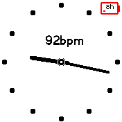
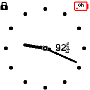

# banglejs-2-date-complication #

draws the current heart rate reading as complication for an analog clock on a Bangle.js 2

This module displays the current heart rate as a complication for an analog clock on a [Bangle.js 2](https://www.espruino.com/Bangle.js2).

<table>
 <tr valign="top">
   <td align="center"><br>small HRM complication</td>
   <td align="center"><br>large HRM complication</td>
 </tr>
</table>

## Usage ##

Within a clock implementation, the module may be used as follows:

```javascript
let Clockwork = require(...);
Clockwork.windUp({
  complications: {
    b:require('https://raw.githubusercontent.com/DanielDecker/banglejs-2-HRM-complication/main/Complication.js'),
  }
  ...
});
```

It supports both small and large complication areas and adjusts its output automatically.

## Example ##

The following code shows a complete example for a (still simple) analog clock using this complication:

```javascript
let Clockwork = require('https://raw.githubusercontent.com/rozek/banglejs-2-simple-clockwork/main/Clockwork.js');

Clockwork.windUp({
  face: require('https://raw.githubusercontent.com/DanielDecker/banglejs-2-only-dots-clock-face/main/ClockFace.js'),
  hands:require('https://raw.githubusercontent.com/rozek/banglejs-2-hollow-clock-hands/main/ClockHands.js'),
  complications: {
    b:require('https://raw.githubusercontent.com/DanielDecker/banglejs-2-HRM-complication/main/Complication.js'),
  }
},{
  Foreground:'#000000', Background:'#FFFFFF', Seconds:'#FF0000',
  withDots:true
});
```

## License ##

[MIT License](LICENSE.md)
